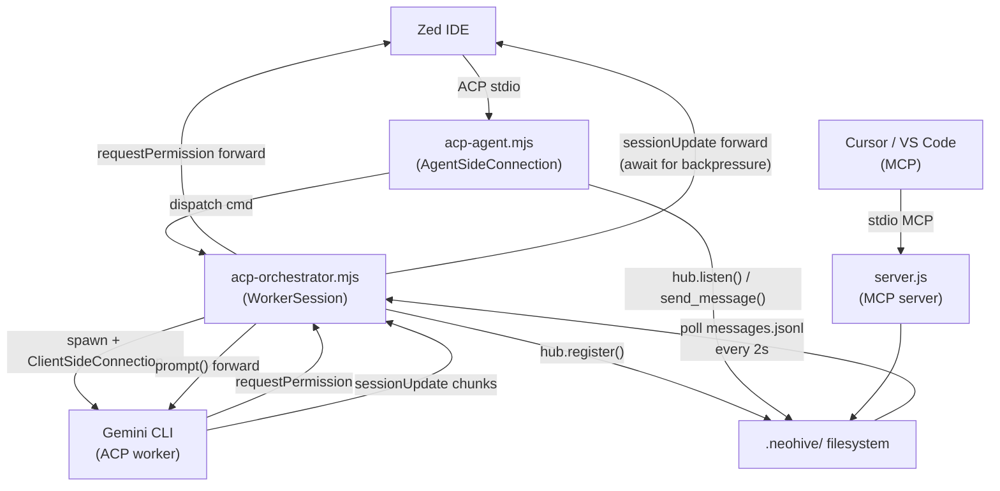

# ACP Dual-Node Router — Multi-Agent Workflow Plan

## Context: Current State

The following MRs are already merged and in the repository:

- **MR-0** — `scripts/acp-spike.mjs` (ACP spike)
- **MR-1** — `core/hub.js` (five hub façade exports)
- **MR-2** — `acp-agent.mjs` (Neohive as ACP Server, full `AgentSideConnection`)

Pending work from `SPEC.md §14` + Phase 2 (new):

| MR | Title | Phase | Depends on |
|---|---|---|---|
| MR-3 | `init --acp` + docs | Front-end | MR-2 merged |
| MR-4 | ACP Registry PR | Distribution | MR-2 or MR-3 |
| MR-5 | WorkerSession spawner | Back-end core | MR-3 + Lead approval |
| MR-6 | Hub-to-worker bridge | Back-end routing | MR-5 merged |
| MR-7 | Worker lifecycle + config | Back-end ops | MR-6 merged |

---

## Workflow Steps & Agent Assignments

### Step 1 — MR-3: `init --acp` + Docs `[Coder]`

**Files:** [`agent-bridge/cli.js`](agent-bridge/cli.js), [`agent-bridge/templates/acp-zed.json`](agent-bridge/templates/acp-zed.json), `README.md`, `docs/documentation.md`

**Template path note:** Two distinct config shapes exist in the repo:
- [`templates/acp-zed.json`](agent-bridge/templates/acp-zed.json) — ACP **registry manifest** format (`name`, `command`, `args`, `capabilities`)
- [`agent-bridge/.zed/acp.json`](agent-bridge/.zed/acp.json) — **Zed IDE** format (`agent_servers.neohive.type/command/args/env`)

`init --acp` must write the **Zed IDE format** (`agent_servers` wrapper) to `${cwd}/.zed/acp.json`, sourced from the `.zed/acp.json` shape — not the registry manifest. Both are already in the repo; the init command just needs to clearly document which it copies, and the README must not conflate them.

Tasks:
- Add `npx neohive init --acp` subcommand to `cli.js` that writes the Zed IDE format (modelled on [`agent-bridge/.zed/acp.json`](agent-bridge/.zed/acp.json)) to `${cwd}/.zed/acp.json` idempotently
- Replace any hardcoded absolute path in the template with the relative npm package path (`node_modules/neohive/acp-agent.mjs`) and the static-fallback note from `SPEC.md §7.1` (no unexpanded `${workspaceName}` tokens)
- Add "ACP + Zed" section to README and docs distinguishing the IDE config from the registry manifest

**Review gate:** Init is idempotent; written file is Zed IDE format, not registry manifest; paths match published npm layout; Zed smoke still passes after doc changes.

---

### Step 2 — MR-4: ACP Registry (parallel, external) `[Researcher]`

**Target repo:** `agentclientprotocol/registry`

Tasks:
- Draft `agent.json` for the Neohive registry entry (name, description, command path from `SPEC.md §7.1`)
- Optional `icon.svg`
- Open PR to upstream registry after MR-2 or MR-3 is confirmed merged

**Review gate:** Registry maintainer requirements met; cross-link added to Neohive README.

---

### Step 3 — MR-5: WorkerSession Spawner `[Coder]`

**New file:** `agent-bridge/acp-orchestrator.mjs`

Key implementation in `WorkerSession`:

```javascript
// agent-bridge/acp-orchestrator.mjs
import { ClientSideConnection, ndJsonStream, PROTOCOL_VERSION } from '@agentclientprotocol/sdk';
import { spawn } from 'node:child_process';
import { Readable, Writable } from 'node:stream';

export class WorkerSession {
  constructor({ command, args, hubName, upstreamConn, upstreamSessionId }) { ... }

  _makeClientHandler() {
    return {
      // async is explicit: requestPermission returns a Promise from the upstream connection
      requestPermission: async (params) => this.upstreamConn.requestPermission(params),
      // MUST await for backpressure: do not fire-and-forget
      sessionUpdate: async (params) => {
        await this.upstreamConn.sessionUpdate({ sessionId: this.upstreamSessionId, update: params.update });
      },
    };
  }

  async init(cwd) { /* initialize + newSession + hub.register(hubName) */ }
  async prompt(text) { /* conn.prompt() forwarded from Zed */ }
  async cancel() { /* propagate cancel downstream */ }

  // Full destroy() defined in MR-6; placeholder here for structure only.
  // See Step 4 for the canonical version with _stopped, clearTimeout,
  // hub.unregister(), and this._process.kill().
  destroy() { /* → see Step 4 (MR-6) for full implementation */ }
}
```

State added to `NeohiveAcpAgent.sessions` in [`agent-bridge/acp-agent.mjs`](agent-bridge/acp-agent.mjs):

```javascript
sessions: Map<upstreamSessionId, {
  pendingPrompt: AbortController | null,
  worker: WorkerSession | null,   // new
}>
```

**Session teardown ownership:** `NeohiveAcpAgent` owns `worker.destroy()`. It must be called in three places:
1. `cancel(params)` — Zed cancels the prompt turn; cancel the worker then call `destroy()`
2. `connection.signal.addEventListener('abort', ...)` — upstream Zed connection closes (process exit or disconnect); iterate `sessions`, call `destroy()` on any live worker
3. After `prompt()` completes normally (if the worker is prompt-scoped, not persistent) — call `destroy()` in the `finally` block

Do not leave workers running after the Zed session ends. If workers are intended to persist across turns (persistent worker model), document that lifetime explicitly and add a `session/close` or explicit `terminate` command instead.

**PID semantics note:** `hub.register(hubName)` calls `hubRegisterAgent` in [`lib/agents.js`](agent-bridge/lib/agents.js), which writes `process.pid` of the **orchestrator** process into `agents.json` — not the child's PID. If the child exits while the orchestrator lives, the hub row stays alive and the dashboard shows misleading liveness.

`hub.unregister` does **not exist** in [`core/hub.js`](agent-bridge/core/hub.js) or `lib/agents.js` today. MR-5 must add it as a **sixth export** on `core/hub.js`:

```javascript
// core/hub.js — add alongside existing five exports
function unregister(name) {
  return agents.hubUnregisterAgent(name);
}
module.exports = { register, sendMessage, listAgents, getBriefing, listen, unregister };
```

And the corresponding thin helper in `lib/agents.js`:

```javascript
function hubUnregisterAgent(name) {
  lockAgentsFile();
  try {
    const all = getAgents(true);
    if (!all[name]) return { success: true, already_gone: true };
    // PID safety: only the registering process (or a process whose child just exited)
    // should be allowed to remove this row. Blind delete lets any process evict any name.
    if (all[name].pid !== process.pid) {
      return { error: `Cannot unregister "${name}": owned by PID ${all[name].pid}, caller is ${process.pid}` };
    }
    delete all[name];
    saveAgents(all);
    // heartbeatFile() is exported from lib/agents.js (line 80/225):
    //   function heartbeatFile(name) { return path.join(DATA_DIR, `heartbeat-${name}.json`); }
    // Use agents.heartbeatFile(name) when calling from core/hub.js via require('../lib/agents').
    try { fs.unlinkSync(agents.heartbeatFile(name)); } catch { /* already gone */ }
    return { success: true, name };
  } finally {
    unlockAgentsFile();
  }
}
```

`profiles.json` and `agent-cards.json` entries can be left intact (persistent metadata). Wire `WorkerSession` to call `hub.unregister(this.hubName)` inside `destroy()` and on `this._process.on('exit', ...)`.

**Elicitation / cancel note:** `requestPermission` forwarding is plausible given the SDK type alignment, but Zed + the target worker must both behave correctly under cancel (Zed must respond with `Cancelled` outcome to any in-flight `requestPermission` when it sends `session/cancel`). Verify this in the MR-5 spike with a real interaction before relying on it. For MVP, a stub that auto-approves is acceptable; the forwarding path is a stretch goal for MR-5.

**Review gate:** Worker registers in dashboard; child process exit triggers hub cleanup; no zombie processes on destroy; `sessionUpdate` always awaited; `requestPermission` forwarding either verified against a real Zed+worker interaction or documented as stubbed.

---

### Step 4 — MR-6: Hub-to-Worker Message Bridge `[Coder]`

**Files modified:** `acp-orchestrator.mjs`, `acp-agent.mjs`

Add `startHubPoll()` to `WorkerSession`. `hub.listen()` delegates to `hubListenNext` in [`lib/messaging.js`](agent-bridge/lib/messaging.js) — it is **synchronous, non-blocking**, does a full read of `messages.jsonl`, and returns `{ success: true, message: m | null }`. Check `result.message !== null`, not a `.empty` flag.

`setInterval` with an async callback is unsafe here because a slow `prompt()` call can overlap the next tick. Use a **`setTimeout` chain with an in-flight guard** instead:

```javascript
startHubPoll(intervalMs = 2000) {
  let polling = false;
  const tick = async () => {
    if (this._stopped) return;                      // no-op after destroy()
    if (!polling) {
      polling = true;
      try {
        const result = hub.listen(this.hubName);   // { success, message }
        if (result.message) {
          const m = result.message;
          await this.prompt(`[hub message from ${m.from}]: ${m.content}`);
        }
      } finally {
        polling = false;
      }
    }
    if (!this._stopped) {
      this._pollTimeout = setTimeout(tick, intervalMs);
    }
  };
  this._pollTimeout = setTimeout(tick, intervalMs);
}

destroy() {
  this._stopped = true;           // sentinel: next scheduled tick no-ops after clearTimeout race
  clearTimeout(this._pollTimeout);
  hub.unregister(this.hubName);   // sixth export added in MR-5 (see unregister sub-task)
  this._process.kill();
}
```

For higher message throughput, replace the fixed `setTimeout` interval with `fs.watch` on `messages.jsonl` (as noted in the original analysis). Do not use `setInterval` with an async body.

Add `dispatch` command to `parsePromptTurn()` in `acp-agent.mjs`:

```
dispatch worker=gemini cwd=/path/to/project
Your task instructions here.
```

This spawns a `WorkerSession`, calls `init()`, starts hub poll, calls `prompt()`, streams results to Zed via forwarded `sessionUpdate`, then cleans up. Cancel from Zed propagates to `worker.cancel()`.

**Security / trust boundary:** `dispatch` accepts a `worker` ID and a `cwd`. Both must be validated before use. `worker` must be looked up by ID from `workers.json` — never passed directly as a command string (avoids arbitrary shell execution). `cwd` must be restricted to the workspace roots advertised during `newSession` (`params.cwd` and `params.additionalDirectories`). Validate using `path.resolve()` on both the candidate and the allowed roots before comparing, so that `../` traversal tricks and Windows `\` separators do not escape the workspace:

```javascript
function isCwdAllowed(candidate, allowedRoots) {
  const resolved = path.resolve(candidate);
  return allowedRoots.some(root => resolved.startsWith(path.resolve(root) + path.sep)
                                 || resolved === path.resolve(root));
}
```

This is same-machine local trust only; document that `dispatch` is not intended for untrusted prompt content.

**Review gate:** MCP agent `send_message(to: workerHubName)` arrives at worker via poll; worker destroy fires on Zed cancel; poll never runs two concurrent `prompt()` calls; dashboard shows worker as a live agent during session.

---

### Step 5 — MR-7: Worker Lifecycle + Config `[Coder]`

**Files:** `agent-bridge/acp-orchestrator.mjs`, `cli.js`, new `templates/acp-workers.json`

Worker config schema (`workers.json`):

```json
{
  "workers": [
    {
      "id": "gemini",
      "command": "gemini",
      "args": ["<flags-tbd>"],
      "env": { "GOOGLE_API_KEY": "${GOOGLE_API_KEY}" }
    }
  ]
}
```

**Worker flags note:** The exact CLI flags for Gemini CLI ACP mode are not finalized here. The reference implementation is Gemini CLI's `zedIntegration.ts` (linked from `SPEC.md §12.1`). Verify the actual invocation against that source before writing the default template — do not invent flags. The `args` field in `workers.json` is user-configurable so this is not a blocker, but the shipped default must use real flags.

- `WorkerSession` reads worker config by ID from `workers.json` on dispatch (not raw `command/args` from user input)
- `cli.js` `init --acp-worker` writes this template idempotently
- README section: "Orchestrating headless ACP workers"
- Error surfaced in Zed UI via `sessionUpdate` text chunk when binary not found

**Review gate:** Init idempotent; unexpanded env vars caught at spawn time; worker config source-of-truth is file, not prompt input.

---

## Architecture: Data Flow After MR-7



## Scope Note: LOC Estimate

The happy-path core for MR-5 (`WorkerSession` class, session mapping, forwarding handlers) is roughly 150–250 lines. Production-quality code covering spawn failures, partial JSON in `ndJsonStream`, session teardown on Zed disconnect, hub errors, and child process crash recovery will be larger. Do not scope MR-5 as "done" at the happy-path skeleton — the review gate checklist items (child exit monitoring, sessionUpdate await, mock requestPermission test) are the minimum bar.

---

## Constraint: What NOT to Build

- No multi-worker elicitation per Zed session (one upstream session ↔ one downstream worker per turn)
- No `server.js` changes in MR-5 or MR-6 — MCP path stays untouched throughout
- No Cursor CLI as a worker (it does not expose ACP server interface)

## Neohive Workflow Config (conceptual — use `create_workflow` to instantiate)

The block below is a human-readable description of the workflow shape. Do not paste it into `workflows.json` directly — it is not valid JSON. To create the live workflow, call `create_workflow` with this structure as the `steps` array via the Neohive MCP tool or dashboard.

```
workflow name: "acp-dual-node-router"
steps:
  1. MR-3: init --acp + docs          → assignee: Coder
  2. MR-4: ACP Registry PR            → assignee: Researcher   [parallel with step 1]
  3. MR-5: WorkerSession spawner      → assignee: Coder        [depends_on: step 1 + Lead approval]
  4. MR-6: Hub-to-worker bridge       → assignee: Coder        [depends_on: step 3 + Lead approval]
  5. MR-7: Worker lifecycle + config  → assignee: Coder        [depends_on: step 4 + Lead approval]
autonomous: false  (Lead review gate between each MR)
```
