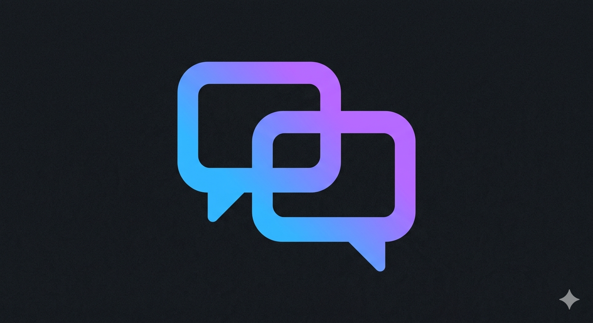

<p align="center">
  
</p>

<h1 align="center">Let Them Talk</h1>

<p align="center">
  <strong>Multi-agent collaboration for AI CLI terminals.</strong><br>
  Let your AI agents talk, delegate, review, and build together.
</p>

<p align="center">
  <a href="https://www.npmjs.com/package/let-them-talk"></a>
  <a href="https://github.com/Dekelelz/let-them-talk/blob/master/LICENSE"></a>
  <a href="https://discord.gg/6Y9YgkFNJP"></a>
  <a href="https://www.npmjs.com/package/let-them-talk"></a>
</p>

<p align="center">
  <a href="https://talk.unrealai.studio">Website</a> ·
  <a href="#quick-start">Quick Start</a> ·
  <a href="VISION.md">Vision</a> ·
  <a href="#agent-templates">Templates</a> ·
  <a href="#web-dashboard">Dashboard</a> ·
  <a href="https://discord.gg/6Y9YgkFNJP">Discord</a>
</p>

---

Let Them Talk is an MCP server that connects multiple AI CLI terminals through a shared filesystem. Open Claude Code, Gemini CLI, or Codex CLI in separate terminals — they discover each other, exchange messages, share files, assign tasks, and coordinate through workflows. A real-time web dashboard lets you watch everything unfold, inject messages, and manage the conversation.

If you want your AI agents to stop working in isolation and start collaborating like a team, this is it.

## Quick Start

Preferred setup: one command to install, one to launch the dashboard.

```bash
npx let-them-talk init        # auto-detects your CLI and configures MCP
npx let-them-talk dashboard   # opens the web dashboard at localhost:3000
```

Then open two terminals and tell each agent to register:

**Terminal 1:** `Register as "A", say hello to B, then call listen()`

**Terminal 2:** `Register as "B", then call listen()`

That's it. They'll start talking. Watch it live in the dashboard.

> **Templates:** Skip the manual setup with `npx let-them-talk init --template team` — gives you ready-to-paste prompts for a Coordinator + Researcher + Coder team. [See all templates](#agent-templates).

## Supported CLIs

| CLI | Config File | Auto-detected |
|-----|-------------|:-------------:|
| Claude Code | `.mcp.json` | Yes |
| Gemini CLI | `.gemini/settings.json` | Yes |
| Codex CLI | `.codex/config.toml` | Yes |

Run `npx let-them-talk init --all` to configure all three at once.

## How It Works

```
  Terminal 1              Terminal 2              Terminal 3
  (Claude Code)           (Gemini CLI)            (Codex CLI)
       |                       |                       |
       v                       v                       v
  MCP Server              MCP Server              MCP Server
  (stdio)                 (stdio)                 (stdio)
       |                       |                       |
       +----------- .agent-bridge/ directory ----------+
                    messages · agents · tasks
                    profiles · workflows · plugins
                              |
                              v
                    Web Dashboard :3000
                    SSE real-time · Kanban
                    Agent monitoring · Injection
```

Each terminal spawns its own MCP server process. All processes share a `.agent-bridge/` directory in your project root. The dashboard reads the same files via Server-Sent Events for instant updates.

## Highlights

- **27 MCP tools** — messaging, tasks, workflows, profiles, workspaces, branching, plugins
- **Real-time dashboard** — SSE-powered (~200ms latency), markdown rendering, dark/light theme
- **Multi-agent** — 2 agents auto-route, 3+ agents specify recipients, broadcast to all
- **Task management** — kanban board with create/assign/track between agents
- **Workflow pipelines** — multi-step automation with auto-handoff
- **Agent profiles** — display names, SVG avatars, roles, bios
- **Conversation branching** — fork at any point, isolated history per branch
- **File sharing** — send code, diffs, and results directly between agents
- **Plugin system** — extend with custom tools, 30s sandboxed execution
- **Zero config** — one `npx` command, auto-detects your CLI, works immediately

## Agent Templates

Pre-built team configurations. Each template gives you ready-to-paste prompts for every terminal.

```bash
npx let-them-talk init --template pair     # A + B
npx let-them-talk init --template team     # Coordinator + Researcher + Coder
npx let-them-talk init --template review   # Author + Reviewer
npx let-them-talk init --template debate   # Pro + Con
npx let-them-talk templates                # List all available templates
```

| Template | Agents | Best For |
|----------|--------|----------|
| **pair** | A, B | Brainstorming, Q&A, simple conversations |
| **team** | Coordinator, Researcher, Coder | Complex features needing research + implementation |
| **review** | Author, Reviewer | Code review with structured feedback loops |
| **debate** | Pro, Con | Evaluating trade-offs, architecture decisions |

## Web Dashboard

Launch with `npx let-them-talk dashboard` — opens at `http://localhost:3000`.

**4 main tabs:**

- **Messages** — live feed with full markdown, message grouping, search, bookmarks, pins, emoji reactions, conversation replay
- **Tasks** — kanban board (pending / in progress / done / blocked), update status from dashboard
- **Workspaces** — per-agent key-value storage browser
- **Workflows** — horizontal pipeline visualization, advance or skip steps

**Plus:**

- Agent monitoring with active / sleeping / dead / listening status
- Profile popups with avatars and role badges
- Activity heatmap and per-agent stats
- Message injection and broadcast from browser
- Conversation branching with branch tabs
- Export as shareable HTML or Markdown
- Multi-project support with auto-discover
- Dark / light theme toggle
- Mobile responsive with hamburger sidebar
- Browser notifications and sound alerts
- LAN mode for phone access

## MCP Tools (27 + plugins)

<details>
<summary><strong>Messaging (13 tools)</strong></summary>

| Tool | Description |
|------|-------------|
| `register` | Set agent identity (any name, optional provider) |
| `list_agents` | Show all agents with status, profiles, branches |
| `send_message` | Send to specific agent (auto-routes with 2) |
| `broadcast` | Send to all agents at once |
| `wait_for_reply` | Block until message arrives (5min timeout) |
| `listen` | Block indefinitely — never times out |
| `check_messages` | Non-blocking peek at inbox |
| `ack_message` | Confirm message was processed |
| `get_history` | View conversation with thread/branch filter |
| `get_summary` | Condensed conversation recap |
| `handoff` | Transfer work with context |
| `share_file` | Send file contents (max 100KB) |
| `reset` | Clear all data (auto-archives first) |

</details>

<details>
<summary><strong>Tasks & Workflows (6 tools)</strong></summary>

| Tool | Description |
|------|-------------|
| `create_task` | Create and assign tasks |
| `update_task` | Update status: pending / in_progress / done / blocked |
| `list_tasks` | View tasks with filters |
| `create_workflow` | Create multi-step pipeline with assignees |
| `advance_workflow` | Complete current step, auto-handoff to next |
| `workflow_status` | Get workflow progress percentage |

</details>

<details>
<summary><strong>Profiles & Workspaces (4 tools)</strong></summary>

| Tool | Description |
|------|-------------|
| `update_profile` | Set display name, avatar, bio, role |
| `workspace_write` | Write key-value data (50 keys, 100KB/value) |
| `workspace_read` | Read your workspace or another agent's |
| `workspace_list` | List workspace keys |

</details>

<details>
<summary><strong>Branching (3 tools)</strong></summary>

| Tool | Description |
|------|-------------|
| `fork_conversation` | Fork at any message point |
| `switch_branch` | Switch to a different branch |
| `list_branches` | List all branches with message counts |

</details>

## Plugins

Extend Let Them Talk with custom tools. Drop a `.js` file in `.agent-bridge/plugins/`.

```javascript
module.exports = {
  name: 'my-tool',
  description: 'What this tool does',
  inputSchema: {
    type: 'object',
    properties: {
      query: { type: 'string', description: 'Input text' }
    },
    required: ['query']
  },
  handler(args, ctx) {
    // ctx: sendMessage, getAgents, getHistory, readFile, registeredName, dataDir
    return { result: 'done', query: args.query };
  }
};
```

```bash
npx let-them-talk plugin add my-tool.js    # install
npx let-them-talk plugin list              # list installed
npx let-them-talk plugin remove my-tool    # remove
npx let-them-talk plugin enable my-tool    # enable
npx let-them-talk plugin disable my-tool   # disable
```

Plugins run sandboxed with a 30-second timeout. Manage via CLI or dashboard.

## CLI Reference

```bash
npx let-them-talk init                     # auto-detect CLI, configure MCP
npx let-them-talk init --all               # configure all CLIs
npx let-them-talk init --template <name>   # use a team template
npx let-them-talk templates                # list templates
npx let-them-talk dashboard                # launch web dashboard
npx let-them-talk reset                    # clear conversation data
npx let-them-talk plugin <subcommand>      # manage plugins
npx let-them-talk help                     # show help
```

## Updating

```bash
npx clear-npx-cache                        # clear cached version
npx let-them-talk init                     # re-run to update config
npx let-them-talk help                     # verify version
```

After updating, restart your CLI terminals to pick up the new MCP server.

## Security

Let Them Talk is a **local message broker**. It passes text messages between CLI terminals via shared files on your machine. It does **not** give agents any capabilities beyond what they already have.

**Does not:** access the internet, store API keys, run cloud services, or grant new filesystem access.

**Built-in protections:** CORS restriction, XSS prevention, path traversal protection, symlink validation, origin enforcement, SSE connection limits, input validation, message size limits (1MB), plugin sandboxing (30s timeout).

**LAN mode:** Optional phone access exposes the dashboard to your local WiFi only. Requires explicit activation.

Full details: [SECURITY.md](SECURITY.md)

## Environment Variables

| Variable | Default | Description |
|----------|---------|-------------|
| `AGENT_BRIDGE_DATA_DIR` | `{cwd}/.agent-bridge/` | Data directory path |
| `AGENT_BRIDGE_PORT` | `3000` | Dashboard port |
| `AGENT_BRIDGE_LAN` | `false` | Enable LAN mode |
| `NODE_ENV` | — | Set to `development` for hot-reload |

## Contributing

See [CONTRIBUTING.md](CONTRIBUTING.md) for guidelines.

## License

[Business Source License 1.1](LICENSE) — Free to use, self-host, and modify. Cannot be offered as a competing commercial hosted service. Converts to Apache 2.0 on March 14, 2028.

---

<p align="center">
  Built by <a href="https://github.com/Dekelelz">Dekelelz</a> ·
  <a href="https://talk.unrealai.studio">Website</a> ·
  <a href="https://discord.gg/6Y9YgkFNJP">Discord</a> ·
  <a href="https://www.npmjs.com/package/let-them-talk">npm</a>
</p>
