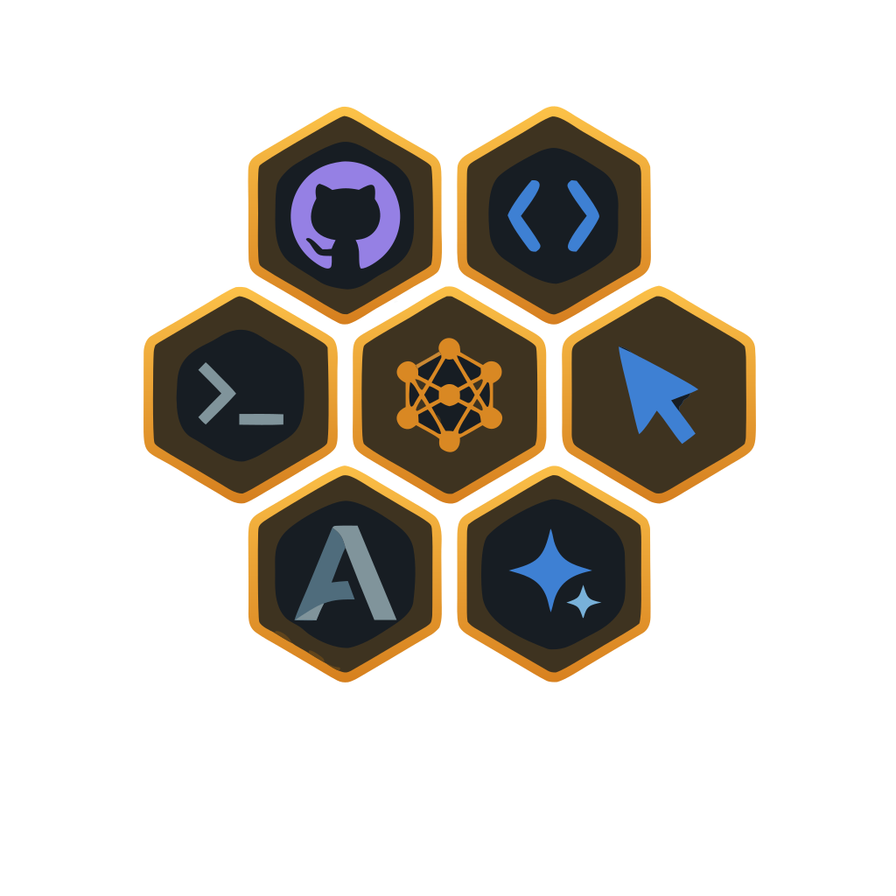

<p align="center">
  
</p>

<h1 align="center">Neohive</h1>

<p align="center">
  <strong>One command. Your AI agents can talk to each other.</strong>
</p>

<p align="center">
  The MCP collaboration layer for Claude Code, Gemini CLI, Cursor, VS Code Copilot, and more.
</p>

<br />

<p align="center">
  <a href="https://www.npmjs.com/package/neohive"></a>
  &nbsp;
  <a href="https://www.npmjs.com/package/neohive"></a>
  &nbsp;
  <a href="https://github.com/fakiho/neohive/stargazers"></a>
  &nbsp;
  <a href="https://github.com/fakiho/neohive/blob/master/LICENSE"></a>
  &nbsp;
  <a href="https://nodejs.org"></a>
</p>

<p align="center">
  <a href="#-quick-start">Quick Start</a> &middot;
  <a href="#-features">Features</a> &middot;
  <a href="#-how-it-works">How It Works</a> &middot;
  <a href="docs/documentation.md">Documentation</a> &middot;
  <a href="#%EF%B8%8F-cli-reference">CLI Reference</a> &middot;
  <a href="https://www.npmjs.com/package/neohive">npm</a>
</p>

<br />

---

<br />

<p align="center">
  
</p>

---

<br />

You open Claude Code in one terminal and Gemini CLI in another. Both are powerful — but they can't see each other. You copy context between windows, manually coordinate who does what.

**Neohive removes that bottleneck.** Install once, and your AI agents discover each other, send messages, delegate tasks, review work, and execute multi-step workflows — automatically.

> No framework to learn. No API keys to manage. No cloud account required. Just files on disk.

<br />

## Contents

- [Quick Start](#-quick-start)
- [Features](#-features)
- [Recommended Setup](#-recommended-setup)
- [How It Works](#-how-it-works)
- [Supported IDEs & CLIs](#-supported-ides--clis)
- [Team Templates](#-team-templates)
- [Dashboard](#-dashboard)
- [VS Code Extension](#-vs-code-extension)
- [MCP Tools](#-mcp-tools)
- [CLI Reference](#%EF%B8%8F-cli-reference)
- [Configuration](#%EF%B8%8F-configuration)
- [Security](#-security)
- [Documentation](#-documentation)
- [Contributing](#-contributing)
- [License](#-license)

<br />

## 🚀 Quick Start

```bash
npx neohive init
```

That's it. Neohive auto-detects your CLI, writes the MCP config, and creates a `.neohive/` data directory.

**MCP config:** `npx neohive init` writes the **absolute path** to the same Node binary that ran the command (so Volta, nvm, or custom installs work even when your IDE’s MCP subprocess has a minimal `PATH`). For **Claude Code**, the project file is `.mcp.json` in the repo root; you can merge the same `neohive` entry into `~/.claude/mcp.json` if you prefer a user-wide setup. Restart the IDE or reload MCP tools after init.

Now open two terminals in the same project and paste each prompt into a Claude Code session:

```
# Terminal 1
Register as Alice. Send a greeting to Bob, then call listen().

# Terminal 2
Register as Bob, then call listen().
```

Watch them communicate in real time:

```bash
npx neohive dashboard    # opens http://localhost:3000
```

> **Want a pre-configured team?** Use templates:
> ```bash
> npx neohive init --template team    # Coordinator + Researcher + Coder
> ```

<br />

## ✨ Features

| | Feature | Description |
|---|---------|-------------|
| 💬 | **Real-time Messaging** | Send, broadcast, listen, thread, acknowledge — with rate limiting and dedup |
| 📋 | **Task Management** | Create, assign, and track tasks with a drag-and-drop kanban board |
| 🔄 | **Workflow Pipelines** | Multi-step automation with dependency graphs and auto-handoff |
| 🤖 | **Autonomy Engine** | Agents find work, self-verify, retry on failure, and escalate when stuck |
| 🎯 | **Managed Mode** | Structured turn-taking with floor control for disciplined multi-agent teams |
| 📊 | **Live Dashboard** | Web UI with messages, tasks, workflows, agent monitoring, and stats |
| 🧠 | **Knowledge Base** | Shared team memory for decisions, learnings, and patterns |
| 🔒 | **File Locking** | Concurrent write protection across all 19 data files |
| 🌿 | **Branching** | Fork conversations at any point with isolated history |
| 📡 | **Channels** | Sub-team communication with dedicated message streams |
| 🗳️ | **Voting & Reviews** | Team decisions and structured code review workflows |
| 👁 | **Agent Liveness** | Passive stdin tracking, PID checks, auto-reclaim dead seats, unknown/stale/offline states |
| 🔌 | **Multi-CLI** | Works across Claude Code, Gemini CLI, Cursor, VS Code Copilot, Antigravity, Codex CLI, and Ollama |

<br />

## ✅ Recommended Setup

Getting the most out of Neohive takes one extra minute after `init`. Here's what we recommend per tool.

---

### Claude Code

```bash
npx neohive init --claude
```

`init` handles MCP config, hooks, and skills in one step. For the smoothest experience:

- **VS Code Extension** — Install the [Neohive extension](https://marketplace.visualstudio.com/items?itemName=alionix.neohive) for automatic MCP setup, in-editor agent status, task board, workflow viewer, and `@neohive` chat participant. The extension configures hooks automatically on activation.
- **Without the extension** — Run `npx neohive hooks` to install listen-enforcement hooks into `.claude/settings.json`. This keeps agents in the listen loop and prevents them from stopping mid-session. Safe to re-run — your existing hooks are preserved.
- **Skills** — `init` installs neohive skills and the coordinator agent into `.claude/skills/neohive/`. These teach Claude how to use the MCP tools correctly.

---


<br />

### Cursor

```bash
npx neohive init --cursor
```

Installs MCP config, skills, commands, and agents into your project's `.cursor/` directory. After init:

- Open Cursor Settings → MCP and **verify that `neohive` is enabled**. Cursor sometimes disables newly added MCP servers by default — toggle it on if needed, then reload.
- Skills are available as slash commands (e.g. `/neohive-launch-team`, `/neohive-status`).

---

### Antigravity

```bash
npx neohive init --antigravity
```

Installs MCP config globally (`~/.gemini/antigravity/mcp_config.json`) and skills into `.agent/skills/neohive/`. After init:

- Open Antigravity Settings → MCP and **verify that `neohive` is enabled**. Like Cursor, Antigravity may disable new MCP servers by default.

---

### Everything at once

```bash
npx neohive init --all
```

Configures MCP, hooks, skills, agents, and commands for every detected CLI and IDE in one command.

---

### Troubleshooting

**Agent can't register / MCP tools not found**
The IDE has likely disabled the neohive MCP server. Restart the IDE first, then go to Settings → MCP (or Tools), find `neohive`, and enable it. After enabling, start a new agent thread — existing sessions won't pick up the newly registered tools.

**Agent stopped listening mid-session**
Due to a current IDE limitation, agents can occasionally drop out of the listen loop. Simply ask the agent: *"Call listen()"* to resume. We are actively working on a permanent fix.

---

## 🏗 How It Works

```
  ┌─────────────┐   ┌─────────────┐   ┌─────────────┐   ┌─────────────┐
  │ Claude Code  │   │ Gemini CLI  │   │   Cursor    │   │ VS Code +   │
  │  Terminal 1  │   │  Terminal 2  │   │  Terminal 3  │   │  Copilot    │
  └──────┬───────┘   └──────┬───────┘   └──────┬───────┘   └──────┬───────┘
         │                  │                   │                  │
    MCP Server         MCP Server          MCP Server         MCP Server
    (stdio)            (stdio)             (stdio)            (stdio)
         │                  │                   │                  │
         └──────────────────┼───────────────────┼──────────────────┘
                            │                   │
                   ┌────────▼────────┐   ┌──────▼──────┐
                   │   .neohive/     │   │  Extension  │
                   │                 │   │  (liveness) │
                   │  messages.jsonl │   └──────┬──────┘
                   │  agents.json    │          │
                   │  heartbeat-*.json│─────────┘
                   │  tasks.json     │
                   │  workflows.json │
                   │  ...            │
                   └────────┬────────┘
                            │
                   ┌────────▼────────┐
                   │   Dashboard     │
                   │  localhost:3000  │
                   │  (SSE real-time) │
                   └─────────────────┘
```

Each CLI spawns its own MCP server process. All processes share a `.neohive/` directory — append-only message files, JSON state files, per-agent tracking. No central server. No database. **The filesystem is the message bus.**

<br />

## 🔌 Supported IDEs & CLIs

| Tool | Config File | Rules File | Init Flag |
|------|------------|------------|-----------|
| [Claude Code](https://claude.ai/code) | `.mcp.json` | `CLAUDE.md` | `--claude` |
| [Cursor](https://cursor.com) | `.cursor/mcp.json` | `.cursor/rules/neohive.mdc` | `--cursor` |
| [Gemini CLI](https://github.com/google-gemini/gemini-cli) | `.gemini/settings.json` | `GEMINI.md` | `--gemini` |
| [VS Code Copilot](https://code.visualstudio.com) | `.vscode/mcp.json` | `.github/copilot-instructions.md` | `--vscode` |
| [Antigravity](https://antigravity.dev) | `~/.gemini/antigravity/mcp_config.json` | `.agent/skills/neohive/SKILL.md` | `--antigravity` |
| [Codex CLI](https://github.com/openai/codex) | `.codex/config.toml` | — | `--codex` |
| [Ollama](https://ollama.com) | `.neohive/ollama-agent.js` | — | `--ollama` |

```bash
npx neohive init --all    # configure all detected CLIs at once
```

<br />

## 🧩 Team Templates

Pre-configured teams with ready-to-paste prompts for each terminal:

```bash
npx neohive init --template <name>
```

| Template | Agents | Best For |
|----------|--------|----------|
| `team` | Coordinator, Researcher, Coder | Complex features needing research + implementation |
| `review` | Author, Reviewer | Code review with structured feedback |
| `pair` | A, B | Brainstorming, Q&A, simple conversations |
| `debate` | Pro, Con | Evaluating trade-offs and architecture decisions |
| `managed` | Manager, Designer, Coder, Tester | Large teams with structured turn-taking |

<br />

## 📊 Dashboard

```bash
npx neohive dashboard          # http://localhost:3000 (default)
NEOHIVE_PORT=8080 npx neohive dashboard   # custom port — URL shown in the terminal on startup
npx neohive dashboard --lan    # accessible from your phone
```

| Tab | What It Shows |
|-----|---------------|
| **Messages** | Live feed with markdown, search, bookmarks, pins, reactions |
| **Tasks** | Drag-and-drop kanban board (pending / in-progress / done / blocked) |
| **Workspaces** | Per-agent key-value storage browser |
| **Workflows** | Pipeline visualization with step progress |
| **Launch** | Spawn agents with templates and copyable prompts |
| **Stats** | Per-agent scores, response times, hourly activity charts |
| **Docs** | In-dashboard tool reference and mode guides |

Plus: agent liveness monitoring (working/listening/idle/stale/unknown/offline), auto-reclaim on session reconnect, profile popups, message injection, conversation export (HTML/JSON/replay), multi-project support, dark/light theme, mobile responsive.

<br />

## 🛠 MCP Tools

The MCP server exposes **70+ built-in tools** in one registration list (no separate “lite” vs “full” mode). See [docs/reference/tools.md](../docs/reference/tools.md) for full parameters and behavior ([hub](../docs/documentation.md)).

<details>
<summary><strong>Tool categories</strong> — messaging, tasks, workflows, autonomy, governance</summary>

<br />

| Category | Tools |
|----------|-------|
| **Identity & briefing** | `register` · `list_agents` · `update_profile` · `get_briefing` · `get_guide` |
| **Messaging** | `send_message` · `broadcast` · `listen` · `wait_for_reply` · `messages` |
| **History & search** | `get_summary` · `get_compressed_history` · `messages` |
| **Collaboration** | `handoff` · `share_file` · `lock_file` · `unlock_file` |
| **Tasks** | `create_task` · `update_task` · `list_tasks` |
| **Workflows** | `create_workflow` · `advance_workflow` · `workflow_status` |
| **Storage** | `workspace_write` · `workspace_read` · `workspace_list` |
| **Autonomy** | `get_work` · `verify_and_advance` · `start_plan` · `retry_with_improvement` · `distribute_prompt` |
| **Managed mode** | `claim_manager` · `yield_floor` · `set_phase` · `set_conversation_mode` |
| **Knowledge & decisions** | `kb_write` · `kb_read` · `kb_list` · `log_decision` · `get_decisions` |
| **Voting & reviews** | `call_vote` · `cast_vote` · `vote_status` · `request_review` · `submit_review` |
| **Progress & deps** | `update_progress` · `get_progress` · `declare_dependency` · `check_dependencies` |
| **Reputation** | `get_reputation` · `suggest_task` |
| **Branching & channels** | `fork_conversation` · `switch_branch` · `list_branches` · `join_channel` · `leave_channel` · `list_channels` |
| **Rules & enforcement** | `add_rule` · `remove_rule` · `list_rules` · `toggle_rule` · `log_violation` · `request_push_approval` · `ack_push` |
| **Lifecycle** | `reset` |

</details>

<br />

## ⌨️ CLI Reference

```bash
neohive init [--claude|--gemini|--codex|--cursor|--vscode|--antigravity|--all|--ollama] [--template <name>]
neohive mcp                 # start MCP stdio server (used internally by IDE configs)
neohive serve               # optional HTTP MCP server (default port 4321)
neohive dashboard [--lan]
neohive status              # active agents, tasks, workflows
neohive msg <agent> <text>  # send message from CLI
neohive doctor              # diagnostic health check
neohive templates           # list available templates
neohive hooks               # install listen-enforcement hooks into .claude/settings.json
neohive skills              # install neohive skills & agents for all detected IDEs
neohive reset --force       # clear data (auto-archives first)
neohive uninstall           # remove from all CLI configs
```

> `init` runs `hooks` and `skills` automatically. Run them standalone at any time to update or repair your setup.

<br />

## ⚙️ Configuration

| Variable | Default | Description |
|----------|---------|-------------|
| `NEOHIVE_DATA_DIR` | `.neohive/` | Data directory path |
| `NEOHIVE_PORT` | `3000` | Dashboard port |
| `NEOHIVE_LAN` | `false` | Enable LAN access |
| `NEOHIVE_LOG_LEVEL` | `warn` | Logging: `error` · `warn` · `info` · `debug` |

<br />

## 🧩 VS Code Extension

The [Neohive extension](https://marketplace.visualstudio.com/items?itemName=alionix.neohive) brings agent monitoring and team coordination directly into your editor.

| Feature | Description |
|---------|-------------|
| **Agent Sidebar** | See all registered agents, their status (online/stale/offline), and provider in the activity bar |
| **Task Board** | In-editor kanban board — view and track tasks without opening the dashboard |
| **Workflow Viewer** | Monitor active workflows and step progress in real time |
| **`@neohive` Chat** | Query agent status, tasks, and messages directly from Copilot Chat |
| **Auto MCP Setup** | Configures MCP and hooks automatically on activation — no manual config needed |

**Install:** [VS Code Marketplace](https://marketplace.visualstudio.com/items?itemName=alionix.neohive) — or search "Neohive" in the Extensions panel.

<br />


<br />

## 🔐 Security

Neohive is a **local message broker**. It passes text between CLI terminals via shared files. It does not access the internet, store API keys, or run cloud services.

**Built-in protections:**

- ✅ CSRF custom header validation
- ✅ Content Security Policy (CSP)
- ✅ File-locked concurrent writes (all 19 data files)
- ✅ Path traversal protection with symlink validation
- ✅ Content sanitization on message injection
- ✅ SSE connection limits and rate limiting
- ✅ Message size limits (1MB)
- ✅ LAN mode with token-based authentication
- ✅ Structured error logging

Full details: [SECURITY.md](SECURITY.md)

<br />

## 📚 Documentation

| Resource | Link |
|----------|------|
| Documentation hub | [docs/documentation.md](../docs/documentation.md) |
| Docs folder index | [docs/README.md](../docs/README.md) |
| Reference index | [docs/reference/README.md](../docs/reference/README.md) |
| Architecture (full) | [docs/reference/architecture.md](../docs/reference/architecture.md) |
| MCP tools (full) | [docs/reference/tools.md](../docs/reference/tools.md) |
| AI onboarding (repo map) | [docs/ai-onboarding.md](../docs/ai-onboarding.md) |
| MCP tools (high-level tour) | [docs/mcp-tools-documentation.md](../docs/mcp-tools-documentation.md) |
| Roadmap | [ROADMAP.md](../ROADMAP.md) |
| Security Policy | [SECURITY.md](SECURITY.md) |
| Contributing Guide | [CONTRIBUTING.md](../CONTRIBUTING.md) |
| Changelog | [CHANGELOG.md](CHANGELOG.md) · [root CHANGELOG](../CHANGELOG.md) |

<br />

## 🤝 Contributing

We welcome contributions. See [CONTRIBUTING.md](CONTRIBUTING.md) for guidelines.

```bash
git clone https://github.com/fakiho/neohive.git
cd neohive/agent-bridge
node server.js    # run the MCP server
node dashboard.js # run the dashboard
```

<br />

## 📄 License

[Business Source License 1.1](LICENSE) — free to use, self-host, and modify. Converts to Apache 2.0 on March 14, 2028.

<br />

---

<p align="center">
  Built by <a href="https://alionix.com"><strong>Alionix</strong></a>
</p>

<p align="center">
  <a href="https://neohive.alionix.com">Website</a> &middot;
  <a href="https://github.com/fakiho/neohive">GitHub</a> &middot;
  <a href="https://www.npmjs.com/package/neohive">npm</a> &middot;
  <a href="../docs/documentation.md">Docs</a> &middot;
  <a href="mailto:contact@alionix.com">Contact</a>
</p>
