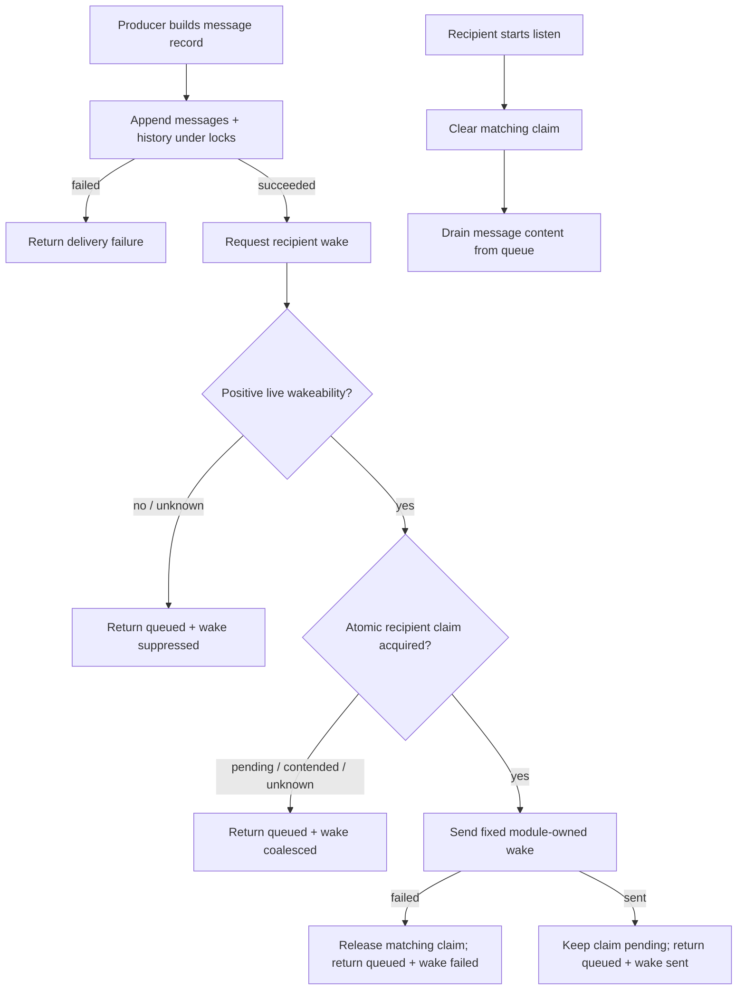

# Architecture Spine: Safe Message Delivery and Coalesced Wake Signals

This is a feature-slice build substrate. It fixes only the invariants that the
message tool, dashboard injector, watchdog, and tmux helper could otherwise
implement incompatibly. The existing CommonJS Node stack, project-local
`.neohive/` storage, message schema, and `listen()` consumption model remain
unchanged.

## Paradigm

**Queue-first delivery with an advisory out-of-band wake.** Persisting content
and waking a recipient are separate operations with different guarantees.
Queueing is authoritative and required; waking is optional, content-free,
best-effort, and may only follow a successful queue append.

## Inherited Invariants

- **INV-BASE-1** — `messages.jsonl` is the recipient-visible content source;
  `history.jsonl` is the audit projection; consumed tracking and `listen()` own
  content retrieval.
- **INV-BASE-2** — shared file mutation uses the existing project-local data-dir
  resolution and `withFileLock` conventions.
- **INV-BASE-3** — `listening_since` is the live indication that a recipient is
  blocked in `listen()`; the persisted `status` field is not a live wake-safety
  signal.
- **INV-BASE-4** — tmux mapping must be live-verified immediately before any
  terminal side effect; cached pane state is advisory only.

## Architecture Decisions

### AD-1 — One queue-first direct-delivery boundary [ADOPTED]
- **Binds:** FR-1–FR-5, FR-9, FR-21–FR-23.
- **Rule:** A shared direct-delivery function accepts a complete message record,
  appends it once to the recipient-visible message file and once to history
  under the existing locks, and only then requests an advisory wake. The
  `send_message` direct path, dashboard `/api/inject`, and direct system/watchdog
  message path use this boundary. Group, channel, and broadcast storage behavior
  remains unchanged. Queue append failure is a delivery failure; wake failure is
  not.
- **Prevents:** terminal delivery replacing queue delivery; duplicate queue or
  history records; caller-specific delivery policy.

### AD-2 — Pane input has one closed wake contract [ADOPTED]
- **Binds:** FR-6–FR-10, NFR-1.
- **Rule:** The wake module owns one immutable constant whose entire meaning is
  “Neohive messages are pending; call `listen()`.” The low-level tmux sender
  accepts no content argument from a delivery caller. Sender names, message
  content, task text, dashboard input, and watchdog text cannot cross this
  boundary. `attemptTmuxDelivery(dataDir, recipient, legacyPayload)` remains
  callable during migration but ignores the legacy payload and delegates only
  to the fixed-wake request. `sendKeysToPane` is narrowed to an internal
  fixed-wake primitive; unrelated terminal-control features must use separately
  named helpers rather than this delivery API.
- **Prevents:** arbitrary payload injection through a forgotten caller or
  backward-compatible signature.

### AD-3 — Wakeability is positive, live evidence; uncertainty means queue-only [ADOPTED]
- **Binds:** FR-11–FR-15, NFR-2, NFR-4, NFR-6.
- **Rule:** The MVP may wake only when all conditions hold: the recipient is
  live; it has a mapped tmux pane; `listening_since` is absent; the PID-to-pane
  mapping verifies live immediately before use; and the existing live pane
  safety check positively permits input. Managed responders, non-tmux agents,
  stale mappings, permission prompts, generating panes, failed captures, lock
  contention, and all unknown states suppress the wake. Suppression never
  changes a successful queue result.
- **Prevents:** speculative terminal input and provider-specific heuristics
  becoming content-delivery dependencies.

### AD-4 — Recipient-scoped durable wake claims coalesce every producer [ADOPTED]
- **Binds:** FR-16–FR-20, NFR-3, NFR-7.
- **Rule:** Wake state lives in one additive project-local file, separate from
  message and agent schemas, keyed by recipient identity. The shared wake module
  atomically claims a recipient under `withFileLock` before `send-keys`.
  Existing `pending` or indeterminate state returns `coalesced` without terminal
  input. A successful send leaves the claim pending. A definite send failure
  releases only the matching claim. Lock/read/write uncertainty fails closed by
  suppressing another wake.
- **Prevents:** independent server and dashboard processes each queuing a wake;
  burst nudges stacking prompts; schema migration of existing records.

### AD-5 — `listen()` acknowledgement, not time, clears a successful wake [ADOPTED]
- **Binds:** FR-18, NFR-3, counter-metric against permanent suppression.
- **Rule:** Starting `listen()` clears the registered recipient's matching wake
  claim before checking queued content, because entering `listen()` proves the
  fixed instruction has been acted on. Registration under a new agent session
  identity may clear an obsolete prior-session claim. Time expiry alone must
  not re-arm a live session: the earlier wake may still be buffered, so a timer
  could create a second queued wake. If a process dies after claiming but before
  recording send outcome, fail closed until `listen()` or a new session clears
  the claim; content remains queued.
- **Prevents:** timer-driven wake stacking and permanent suppression after an
  agent session is replaced.

### AD-6 — Queue and wake outcomes are observably distinct [ADOPTED]
- **Binds:** FR-15, FR-21–FR-24, NFR-5, NFR-8.
- **Rule:** Existing success request shapes remain valid. Delivery success means
  queue success. Additive response/log metadata may report `wake: sent`,
  `wake: coalesced`, `wake: suppressed`, or `wake: failed`, with a reason code
  that contains no message content. Legacy `delivery: "tmux"` is not used to
  imply content transport; compatibility adapters may retain it only as an
  additive/deprecated alias while also reporting authoritative queue delivery.
  Readers must tolerate absent wake metadata and absent wake-state files.
- **Prevents:** callers treating wake failure as message loss or wake success as
  content consumption.

## Shared Decision Flow

## Ownership and Boundaries

- **Shared direct-delivery policy:** owns queue-first ordering, one messages
  append, one history append, and optional wake invocation. Server and dashboard
  adapt existing message construction into it.
- **Wake module:** owns the fixed payload, live safety gate, tmux mapping
  verification, recipient claim file, reason-coded outcomes, and compatibility
  adapter for `attemptTmuxDelivery`.
- **`listen()` lifecycle:** owns wake acknowledgement/clearing; it does not read
  content from wake state.
- **Callers:** own authorization, message validation, routing, and response-shape
  adaptation. They never call tmux delivery primitives with content.

## Hard Verification Invariants

- A busy or unverifiable pane receives zero keystrokes and its message remains
  retrievable through `listen()`.
- Every accepted direct message is queued before a wake is considered.
- No value derived from message, sender, task, dashboard, or watchdog input can
  reach tmux `send-keys`.
- Concurrent producers for one recipient can observe at most one successful
  pending wake claim.
- An active `listen()` suppresses terminal wake and drains queue content.
- Non-tmux and managed responders remain queue-only.

## Deferred

- Richer Cursor-, Claude-, or Codex-specific proof of idle state.
- Alternate wake transports or a generalized notification bus.
- Automatic timer re-arming of successful wake claims.
- Cross-host wake acknowledgement. The MVP state is shared across local Neohive
  server/dashboard processes through the project-local file.
- Dashboard UX beyond backward-compatible additive queue/wake status.
