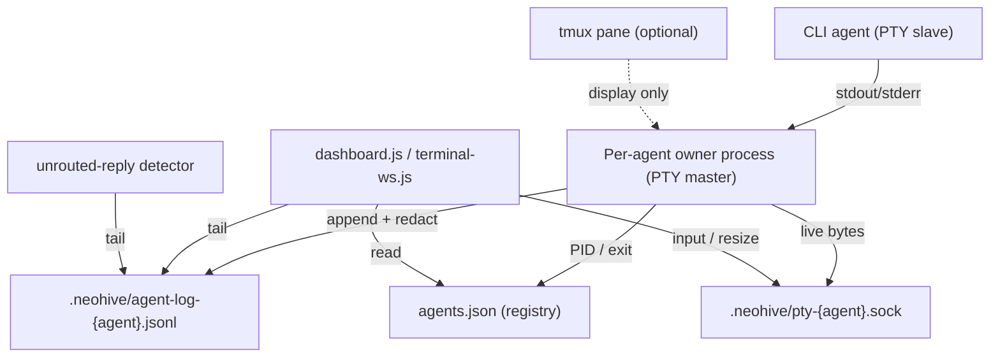

# Architecture Spine — node-pty Agent Launcher

## Design Paradigm

**Supervised per-agent pipeline over a filesystem bus.** Each agent is a pipeline of three stages: `CLI process (PTY slave) → owner/tee (PTY master, captures + redacts) → durable sink (.neohive log file)`. Consumers (dashboard, unrouted-reply detector) are **clients** that read the durable sink and connect to a per-agent control socket for live I/O. This extends neohive's existing model — many independent processes coordinating through the shared `.neohive/` filesystem — rather than introducing a central broker.

Module map:
- `lib/pty-cli-launcher.js` — spawns the owner process, mirrors the `launchNativeCli()` interface of `tmux-cli-launcher.js`.
- Owner process (the PTY holder) — standalone, detached; one per agent.
- `.neohive/agent-log-{agent}.jsonl` — durable capture sink.
- `.neohive/pty-{agent}.sock` — per-agent live I/O control channel.
- `dashboard.js` / `lib/terminal-ws.js` — clients only.

## Invariants & Rules

### AD-1 — PTY ownership lives outside the dashboard process
- **Binds:** `lib/pty-cli-launcher.js`, `dashboard.js`, all agent processes
- **Prevents:** a dashboard restart or crash killing every running agent — a regression vs the tmux daemon, and acute because the dashboard is restarted on every `dashboard.js`/`server.js` code edit (standing workflow).
- **Rule:** the node-pty **master fd is held by a standalone, detached per-agent owner process** (own session via `setsid`/`.unref()`), never by the dashboard or an MCP server process. The dashboard spawns the owner and then disconnects from its lifecycle.

### AD-2 — The log file is the durable source of truth
- **Binds:** owner process, dashboard SSE feed, unrouted-reply detector
- **Prevents:** output loss across any consumer restart; a late-joining dashboard client seeing nothing.
- **Rule:** the owner persists every PTY byte **append-only** to `.neohive/agent-log-{agent}.jsonl` (`{ts,agent,data}` per line — existing convention). Consumers **tail** this file for history. The PRD's 1 MB in-memory ring buffer is a live-latency optimization layered on top, **not** the durability mechanism.

### AD-3 — Single-writer PTY via a per-agent IPC socket
- **Binds:** owner process, dashboard terminal widget, input path
- **Prevents:** multiple-writer races on the PTY master; hard-coupling input to the SSE transport.
- **Rule:** live input and resize events flow over a per-agent unix domain socket `.neohive/pty-{agent}.sock`. The **owner process is the sole caller of `pty.write()`**. Many readers are allowed; for input, the last connection wins (PRD OQ-3).

### AD-4 — tmux is a display surface only, never a dependency [ADOPTED — PRD FR-9]
- **Binds:** owner process, optional tmux integration
- **Prevents:** re-coupling durability/capture to tmux while still letting operators `tmux attach`.
- **Rule:** the owner process **may** be launched inside a tmux pane so operators keep attach, but PTY ownership, capture, and routing **must** function identically with no tmux present at runtime.

### AD-5 — Graceful degradation to the tmux launcher [ADOPTED — PRD OQ-1/OQ-4]
- **Binds:** dashboard launch endpoint
- **Prevents:** a hard launch failure when the node-pty native addon is unavailable.
- **Rule:** if `node-pty` cannot load, surface a warning and fall back to `lib/tmux-cli-launcher.js`; never hard-block the launch. `tmux-cli-launcher.js` stays in-tree, soft-deprecated (PRD §6.1).

### AD-6 — The registry remains the single liveness authority [ADOPTED — PRD FR-7/FR-8]
- **Binds:** owner process, `agents.json`, heartbeat, watchdog
- **Prevents:** a competing agent-liveness model diverging from the existing registry.
- **Rule:** the owner writes the agent PID to `agents.json` on spawn and fires `agent_exit` + registry cleanup on child exit. Heartbeat/watchdog/PID-stale semantics are unchanged.

### AD-7 — The captured stream is sensitive
- **Binds:** log writer, retention policy
- **Prevents:** tokens/keys that pass through an agent terminal leaking into world-readable or under-retained storage.
- **Rule:** `agent-log-{agent}.jsonl` inherits `.neohive/` permissions; a redaction pass strips known secret patterns **before** write; retention matches the `messages.jsonl` policy.

### Dependency direction



Rule encoded: nothing depends **on** the dashboard; the owner never depends on tmux; consumers depend only on the filesystem sink + sockets.

## Consistency Conventions

| Concern | Convention |
| --- | --- |
| Naming | Owner artifacts keyed by sanitized agent name: log `agent-log-{agent}.jsonl`, socket `pty-{agent}.sock`. Reuse `sanitizeName()`. |
| Data & formats | Log lines: `{"ts":"<ISO8601Z>","agent":"<name>","data":"<raw bytes, JSON-escaped>"}`. Socket frames: newline-delimited JSON `{type:"input"|"resize"|"exit", ...}`. |
| State & cross-cutting | PTY master mutated only by the owner (AD-3). Liveness only via `agents.json` (AD-6) — a `pty-{agent}.sock` whose agent has no live PID in `agents.json` is **stale**: discovery MUST ignore it and the owner MUST unlink its socket on exit. Errors surfaced as SSE events + logged to stderr in the existing MCP-stderr style. Fallback path logged, never silent (AD-5). |

## Stack

| Name | Version |
| --- | --- |
| Node.js (CommonJS) | existing runtime |
| node-pty | ^1.1.0 (installed, prebuilds present) |
| tmux (optional display) | existing / detected |

## Structural Seed

```text
lib/
  pty-cli-launcher.js   # spawns owner process; mirrors tmux-cli-launcher.js interface (launchNativeCli, buildNativeCliEnvArgs reuse)
  pty-owner.js          # the detached per-agent PTY holder: owns master fd, tees->log, serves pty-{agent}.sock, redacts, updates agents.json on exit
  tmux-cli-launcher.js  # soft-deprecated fallback (AD-5)
  tmux-agent-state.js   # capture-poll path retired for detection; watchdog/state helpers retained
dashboard.js            # launch endpoint: try pty launcher, fall back to tmux; client of log + socket
.neohive/
  agent-log-{agent}.jsonl   # durable capture sink (AD-2)
  pty-{agent}.sock          # live I/O channel (AD-3)
  agents.json               # liveness authority (AD-6)
```

## Capability → Architecture Map

| PRD requirement | Lives in | Governed by |
| --- | --- | --- |
| FR-1/FR-4 PTY spawn + output stream | `pty-owner.js`, `pty-cli-launcher.js` | AD-1, AD-3 |
| FR-5 unrouted-reply detection | detector tailing log | AD-2 |
| FR-7/FR-8 PID register + exit cleanup | `pty-owner.js` → `agents.json` | AD-6 |
| FR-9 optional tmux display | owner launched-in-pane | AD-4 |
| FR-10 input forwarding | `pty-{agent}.sock` → `pty.write` | AD-3 |
| §5 secret handling | log redaction pass | AD-7 |
| OQ-1/OQ-4 degradation | dashboard launch endpoint | AD-5 |

## Deferred

- **Central supervisor daemon** vs per-agent owner — spine assumes per-agent (OQ-2); revisit if per-agent socket/file fan-out becomes a scale problem.
- **Web terminal renderer** for the owned PTY — only needed if operators drop tmux entirely; out of MVP (PRD Non-Goal / FR-9 v2).
- **Windows PTY backend**, containerized agents, session recording/replay — PRD Non-Goals.
- **Reconnect handshake detail** (OQ-3) — dashboard rediscovers live agents by scanning `.neohive/pty-*.sock` cross-checked against live PIDs in `agents.json` (stale sockets ignored, per Conventions); exact wire framing owned by the implementing story.
- **Log rotation / compaction** — `messages.jsonl` auto-compacts at 500 lines; whether `agent-log-{agent}.jsonl` rotates and how consumers tail across rotation is owned by the implementing story (AD-7 sets the retention policy, not the mechanism).
